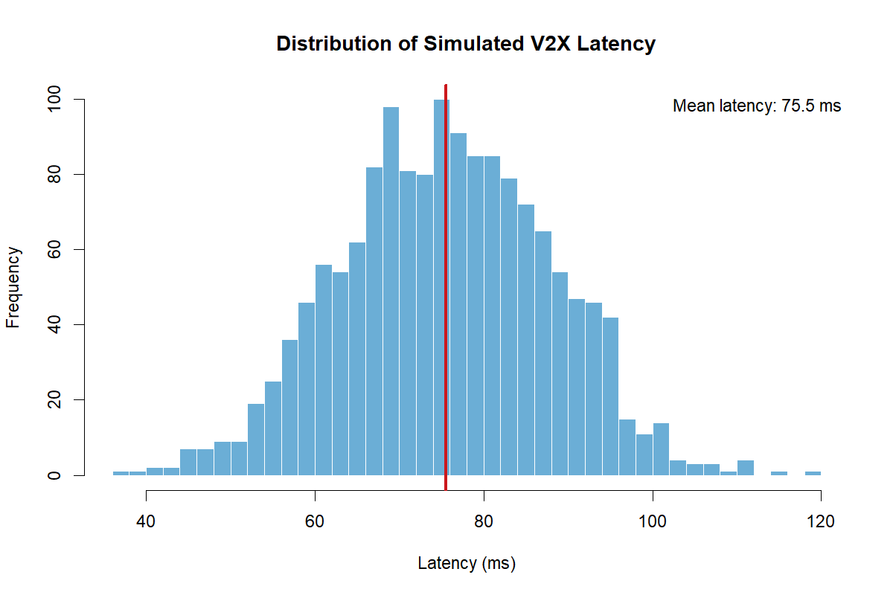
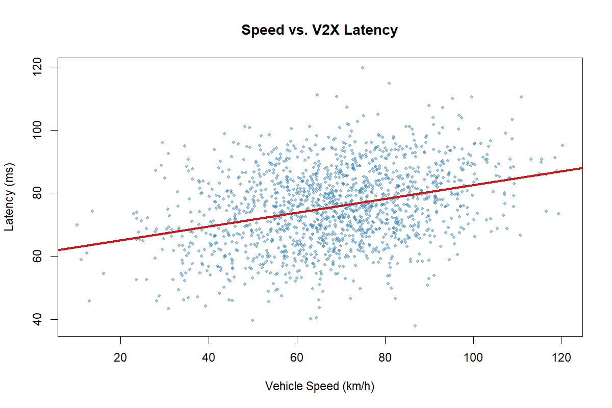
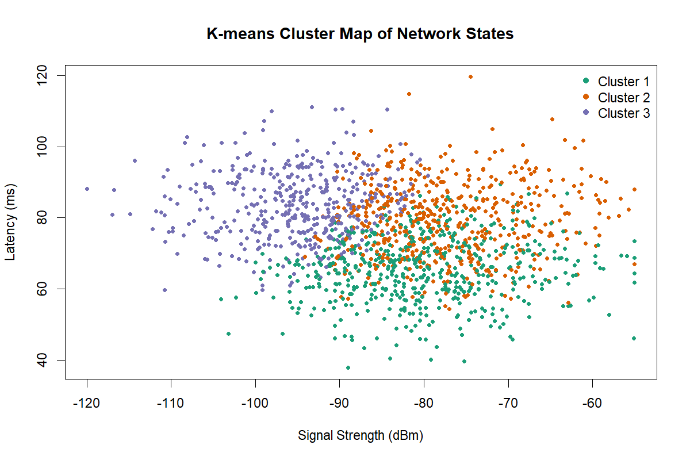
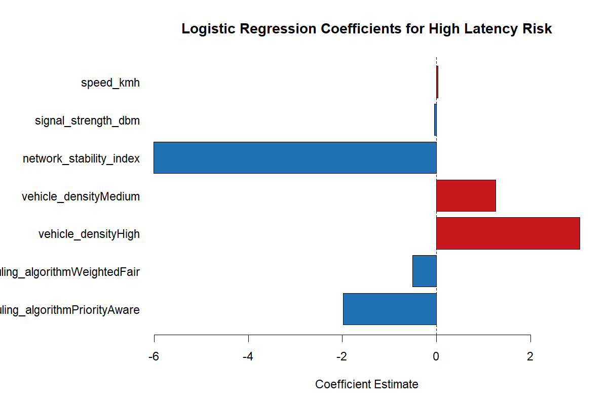

# V2X Latency Analysis

An R-based analysis project for studying communication latency patterns in autonomous driving and V2X scenarios.

## Overview

This repository presents a reproducible analysis workflow for exploring how vehicle speed, signal strength, network stability, traffic density, and scheduling strategy can influence V2X communication latency.

Because the original raw dataset used in the early coursework version of this project is not available in the repository, this version has been rebuilt as a clean and reproducible demo pipeline using a simulated V2X dataset. The goal is to preserve the analytical direction of the project while making the repository easier to understand, run, and extend.

## Objectives

- Explore the distribution of V2X latency values
- Examine relationships between latency and key network or driving variables
- Segment network conditions with clustering
- Model the probability of high-latency events
- Produce repository-ready result figures from a single analysis script

## Repository Structure

```text
v2x-latency-analysis/
├─ data/
│  └─ simulated_v2x_dataset.csv
├─ results/
│  ├─ cluster_map.png
│  ├─ latency_distribution.png
│  ├─ model_coefficients.png
│  ├─ speed_vs_latency.png
│  └─ summary_metrics.csv
├─ scripts/
│  └─ run_analysis.R
├─ .gitignore
└─ README.md
```

## Method

The analysis pipeline includes the following steps:

1. Generate a reproducible simulated V2X dataset
2. Inspect descriptive statistics
3. Visualize the latency distribution
4. Visualize the relationship between speed and latency
5. Cluster network states using K-means
6. Fit a logistic regression model for high-latency risk
7. Export figures and summary tables

## Variables

The simulated dataset contains the following variables:

- `speed_kmh`
- `signal_strength_dbm`
- `network_stability_index`
- `vehicle_density`
- `scheduling_algorithm`
- `latency_ms`
- `high_latency`

## Results

### Latency Distribution



### Speed vs. Latency



### Cluster Map



### Model Coefficients



## How to Run

Use Rscript to execute the analysis pipeline:

```bash
Rscript scripts/run_analysis.R
```

On this machine, the script was executed with:

```bash
"C:/Program Files/R/R-4.5.0/bin/Rscript.exe" scripts/run_analysis.R
```

## Notes

- This repository is written entirely in English for a more professional presentation.
- The current analysis is based on simulated data so that the repository remains runnable without any missing private files.
- If the original dataset becomes available later, the script can be adapted to load the real CSV instead of generating synthetic data.

## Author

Heeyoung Jeong

Interests: Intelligent Transportation Systems, V2X, autonomous driving, traffic safety, and data analysis
