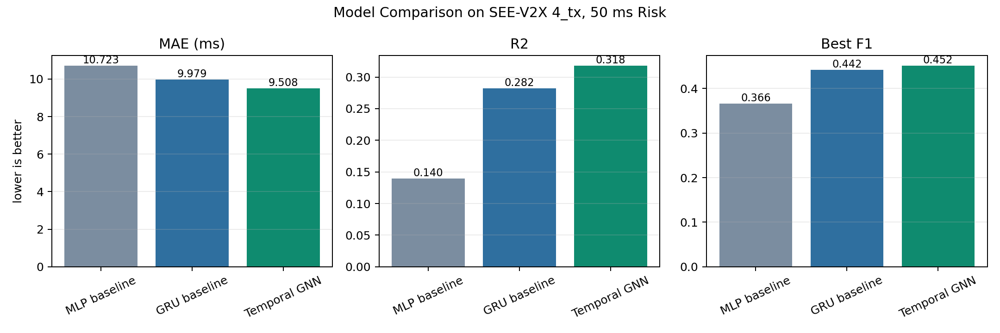
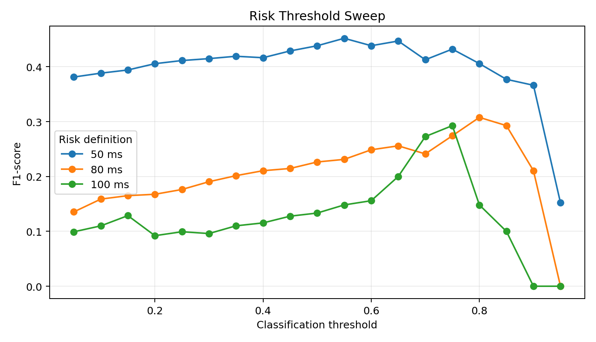
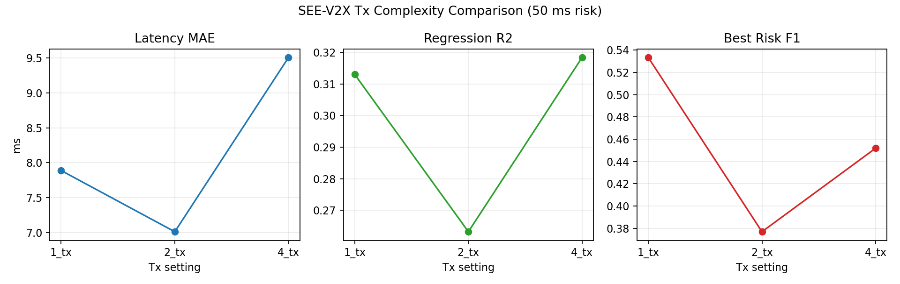

# V2X Latency Prediction with Temporal Graph Neural Networks

Python-based research project for predicting V2X communication latency and detecting high-risk delay events from real C-V2X traces.

This project started as an R-based exploratory analysis of V2X latency and was extended into a deep learning research pipeline using PyTorch, Temporal Graph Neural Networks, and real SEE-V2X receiver logs.

## Project Summary

V2X communication latency is a safety-critical factor in autonomous driving and connected mobility. This repository studies whether temporal and graph-aware deep learning models can predict communication delay and identify high-latency risk from C-V2X network traces.

The main model represents transmitter-to-receiver communication links as graph nodes, groups packet traces into timestamp bins, and learns both temporal patterns and link-level interactions.

## Research Questions

- Can deep learning predict V2X communication latency from real C-V2X receiver traces?
- Does a Temporal GNN outperform non-graph baselines such as MLP and GRU?
- How does high-latency risk detection change under 50 ms, 80 ms, and 100 ms thresholds?
- How does model behavior change across SEE-V2X `1_tx`, `2_tx`, and `4_tx` communication settings?

## Dataset

The real-data experiments use the SEE-V2X C-V2X dataset.

- Project page: https://cisl.ucr.edu/SEE-V2X/
- Dataset/code description: https://github.com/UCR-CISL/SEE-V2X/

The repository does **not** include the full SEE-V2X dataset because the raw archive is large and distributed separately by the dataset authors. The code includes a converter for SEE-V2X `rx_*.csv` receiver traces and a tiny SEE-V2X-style fixture under `examples/` for pipeline validation.

## Method

The completed pipeline includes:

1. Convert SEE-V2X receiver logs into a canonical temporal CSV.
2. Group records into timestamp bins.
3. Represent each communication link, such as `t1->t3`, as a graph node.
4. Train multi-task models for:
   - latency regression
   - high-latency risk classification
5. Compare Temporal GNN against GRU and MLP baselines.
6. Evaluate threshold sensitivity and Tx-complexity settings.

## Models

| Model | Description |
|---|---|
| MLP baseline | Uses latest node features only |
| GRU baseline | Models each communication link over time without graph attention |
| Temporal GNN | Uses graph attention within each time step and GRU temporal encoding |

## Key Results

### Model Comparison

SEE-V2X `4_tx` full experiment, 50 ms high-latency threshold:

| Model | MAE (ms) | RMSE (ms) | R2 | Best F1 |
|---|---:|---:|---:|---:|
| Temporal GNN | 9.51 | 16.42 | 0.318 | 0.452 |
| GRU baseline | 9.98 | 16.85 | 0.282 | 0.442 |
| MLP baseline | 10.72 | 18.44 | 0.140 | 0.366 |



### Risk Threshold Sensitivity

Temporal GNN on SEE-V2X `4_tx`:

| Risk Threshold | MAE (ms) | RMSE (ms) | R2 | Positive Rate | Best F1 |
|---|---:|---:|---:|---:|---:|
| 50 ms | 9.51 | 16.42 | 0.318 | 0.093 | 0.452 |
| 80 ms | 9.60 | 16.55 | 0.308 | 0.025 | 0.308 |
| 100 ms | 9.54 | 16.18 | 0.338 | 0.009 | 0.293 |



### Tx-Complexity Comparison

50 ms high-latency threshold:

| Setting | Links | Rows | MAE (ms) | RMSE (ms) | R2 | Best F1 |
|---|---:|---:|---:|---:|---:|---:|
| `1_tx` | 1 | 181,683 | 7.89 | 14.36 | 0.313 | 0.533 |
| `2_tx` | 2 | 348,108 | 7.01 | 11.54 | 0.263 | 0.377 |
| `4_tx` | 9 | 1,530,040 | 9.51 | 16.42 | 0.318 | 0.452 |



The Tx-complexity experiment should be interpreted as empirical behavior across SEE-V2X configurations, not as a perfectly controlled causal study of link count alone.

## Dashboard

The Streamlit dashboard visualizes:

- predicted vs actual latency
- prediction error distribution
- model comparison
- risk-threshold sweep
- `1_tx`, `2_tx`, and `4_tx` comparison

Run it with:

```bash
python -m streamlit run app/streamlit_dashboard.py
```

Then open:

```text
http://localhost:8501
```

## Repository Structure

```text
v2x-latency-analysis/
|-- app/
|   |-- streamlit_dashboard.py
|-- data/
|   |-- simulated_v2x_dataset.csv
|-- docs/
|   |-- real_temporal_dataset_workflow.md
|   |-- temporal_gnn_research_plan.md
|-- examples/
|   |-- see_v2x_sample/
|-- results/
|   |-- experiment_summary.csv
|   |-- model_comparison_summary.csv
|   |-- tx_complexity_summary.csv
|   |-- figures/
|-- scripts/
|   |-- create_visualizations.py
|   |-- prepare_see_v2x_dataset.py
|   |-- run_analysis.R
|   |-- train_temporal_gnn.py
|-- src/
|   |-- v2x_tgnn/
|       |-- data.py
|       |-- models.py
|       |-- see_v2x.py
|       |-- train.py
|-- requirements.txt
|-- README.md
```

## Quick Start

Install dependencies:

```bash
python -m pip install -r requirements.txt
```

Run the simulated-data smoke test:

```bash
python scripts/train_temporal_gnn.py --epochs 5
```

Generate presentation figures:

```bash
python scripts/create_visualizations.py
```

Launch the dashboard:

```bash
python -m streamlit run app/streamlit_dashboard.py
```

## Using SEE-V2X Data

After downloading and decompressing SEE-V2X, convert receiver traces:

```bash
python scripts/prepare_see_v2x_dataset.py ^
  --input-dir "C:/path/to/SEE-V2X/indoor_allconfigs/4_tx" ^
  --output data/see_v2x_4tx_temporal.csv ^
  --high-latency-ms 50
```

Train the Temporal GNN:

```bash
python scripts/train_temporal_gnn.py ^
  --model-type tgnn ^
  --dataset-type temporal ^
  --data data/see_v2x_4tx_temporal.csv ^
  --output-dir results/see_v2x_4tx_full_thr50_real ^
  --epochs 30 ^
  --batch-size 128 ^
  --seq-len 6 ^
  --num-nodes 8 ^
  --stride 64 ^
  --time-bin-ms 100 ^
  --min-valid-targets 4
```

See [docs/real_temporal_dataset_workflow.md](docs/real_temporal_dataset_workflow.md) for the full real-data workflow.

## Important Notes

- Large raw SEE-V2X files are intentionally ignored by Git.
- Generated model checkpoints are ignored and can be regenerated.
- Public result CSV/PNG files are kept for reproducibility and GitHub presentation.
- The included `examples/see_v2x_sample/` files are only for testing the converter and training path.
- The original R script remains in `scripts/run_analysis.R` to preserve the starting point of the project.

## Author

Heeyoung Jeong

Research interests: Intelligent Transportation Systems, V2X, autonomous driving, traffic safety, data analysis, and deep learning.
